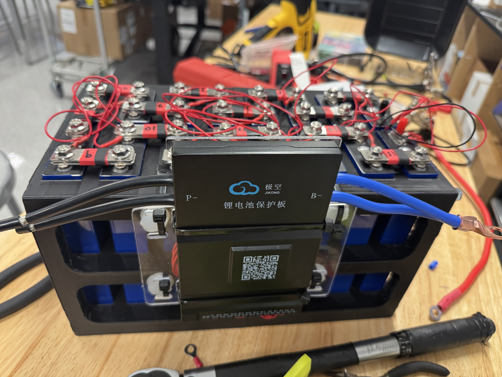
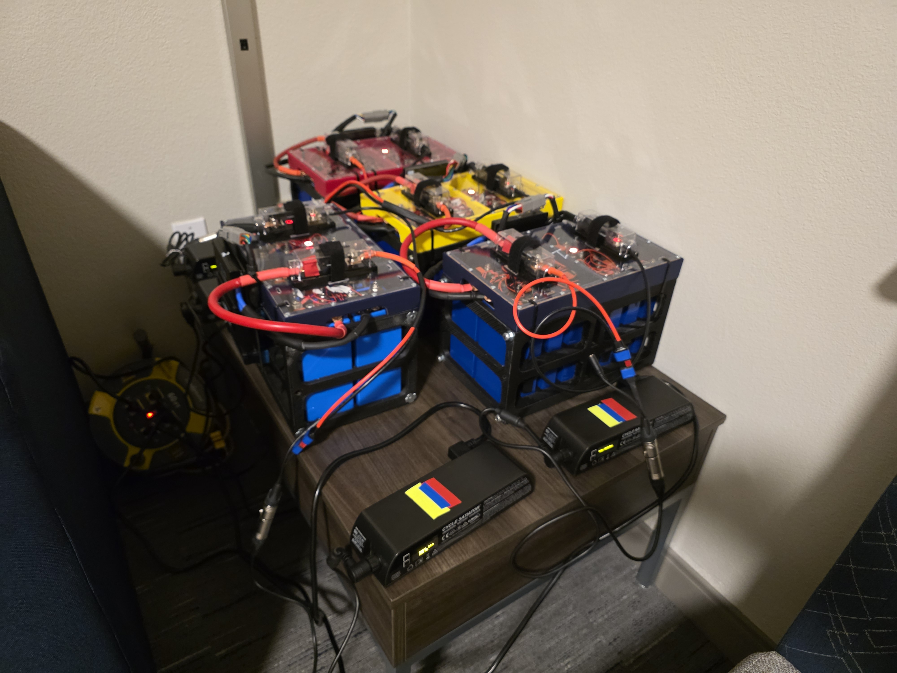
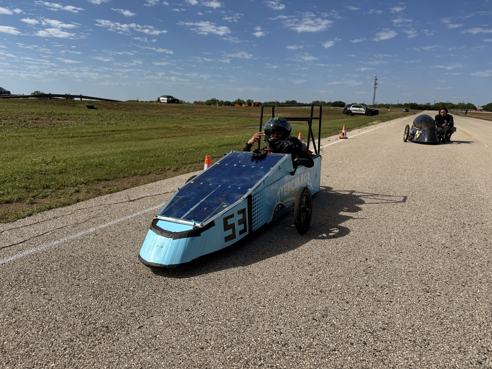
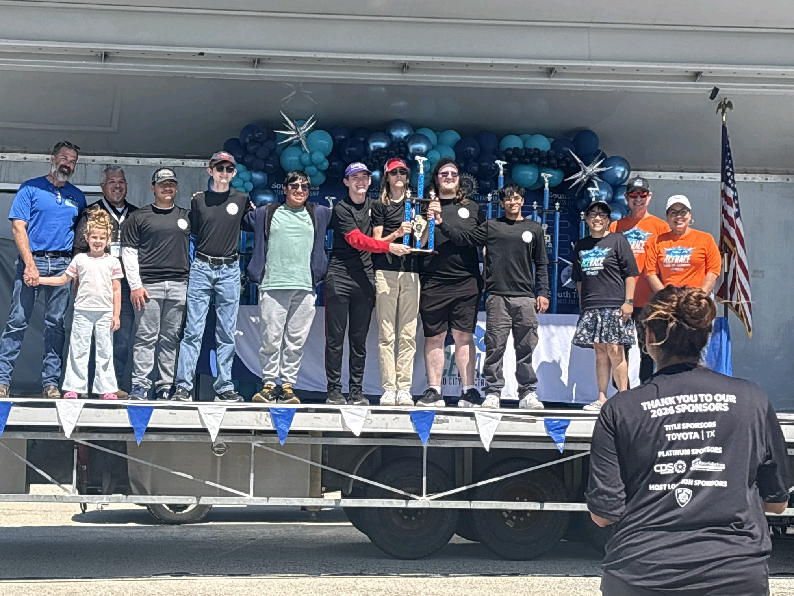
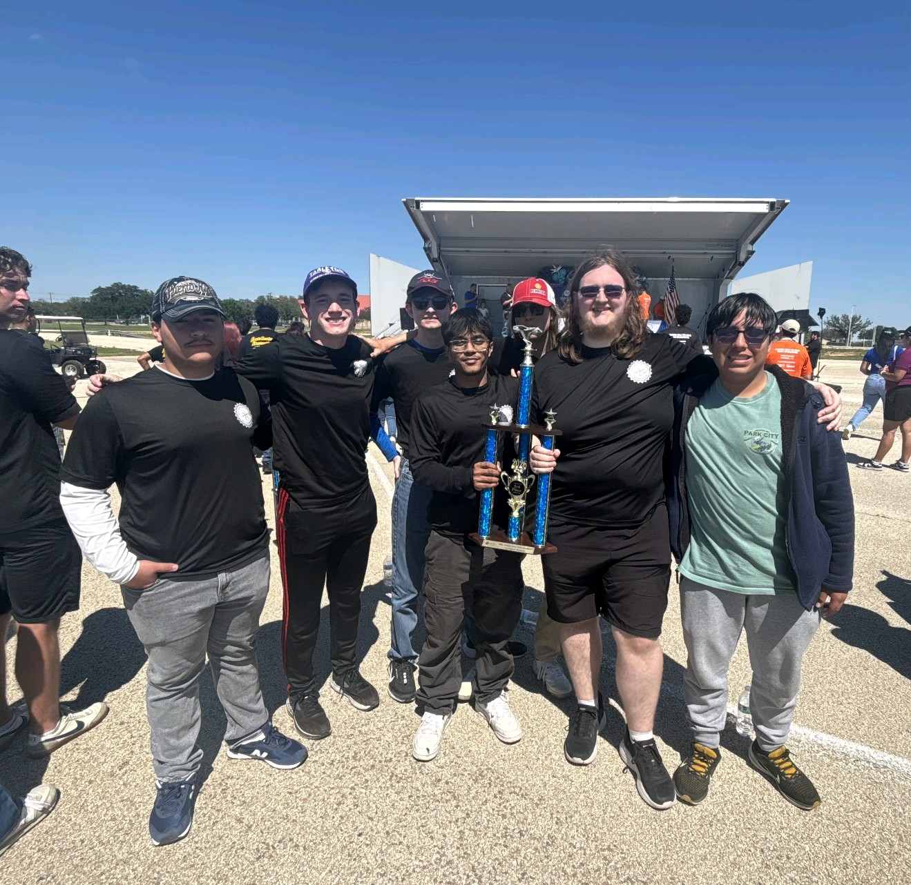

# Electrathon EV Race Car — Battery System, Solar Panels & Drivetrain CAD

## Video Walkthrough

## Overview
Contributed to the design and build of a competitive electric race car 
competing in the Alamo City Electrathon, the ACE Race, as part of Keller ISD. 
Placed 3rd overall.

## My Contributions
- Built and wired a custom lithium-ion battery pack using lithium ion phosphate cells 
  and a Jikong BMS
- Decided cell layout for target voltage and capacity
- Contributed to CAD design of battery case and drive sprocket using Onshape
- Assembled and wired solar panels integrated into the car body, we were
  the only team in the competition with solar capability

## Battery System
- BMS: Jikong with cell balancing and overcurrent protection
- Case: Custom designed in Onshape, and 3D printed
- Wiring: Manually crimped and soldered connections 

## CAD Files
| File | Description |
|---|---|
| `Battery Holder Case CAD.step` | Battery enclosure structure |
| `Cell Arrangement with bars CAD.step` | Cell layout with bus bars |
| `Final Finished Battery CAD.step` | Complete battery assembly |
| `Sprocket CAD.step` | Drive sprocket |

## Competition Results
| Event | Result |
|---|---|
| Alamo City Electrathon |  3rd Place as Keller ISD |

## Build Photos

### Battery — CAD

### Battery — Real Build

### Sprocket — CAD

### Solar Panels

### Competition

